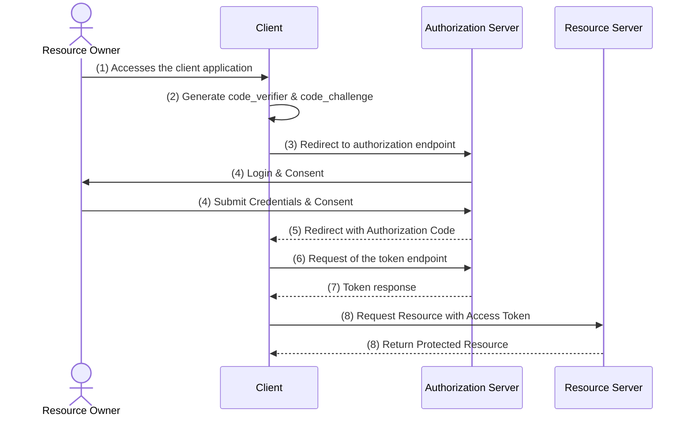

In situations where the client wants to retrieve a token, but can't store the clientSecret (client side rendered Frontends or mobile applications), the PKCE flow comes into place.



### 1 - Accessing the client application
- The user accesses the client application
- If the user isn't already logged in, step 2 comes into place

### 2 -  Generate code_verifier & code_challenge
-  Before the user is sent to the authorization page, the client generates a secret called `code_verifier` (Base64 encrypted)
- The `code_verifier` is then run through a one-way-cryptographic algorithm like sha256, which creates a hashed value named `code_challenge` (Base64 encrypted)
- The client application redirecting the user to an authorization endpoint of the authorization server

```
code_verifier: Wa9jW0rpU7EPxDUL7xYkyBZjHaKd8bV3S9u3vMvYxsHkBvZBYzE9U1f7V0WyExX3

code_challenge: SHA256(code_verifier)
= SHA256(Wa9jW0rpU7EPxDUL7xYkyBZjHaKd8bV3S9u3vMvYxsHkBvZBYzE9U1f7V0WyExX3)
= x_1FGOZ-vOYhLx0rsoF3akIvplPwnTzXFDLOjwIjDbM
```

### 3 - Redirect to authorization endpoint

- It passes the clientId, redirectUri and the challenge at min (also scopes can be specified)

`https://<auth-server-host>/authorize?`  
`response_type=code`  
`&client_id=<client_id>`  
`&redirect_uri=https://<client_host>/redirect`  
`&scope=profile%20photos%3Aread`
`&challenge=x_1FGOZ-vOYhLx0rsoF3akIvplPwnTzXFDLOjwIjDbM`

- The challenge is saved by the authorization server and not send back to the client on redirect

### 4 - Login
- The authorization server waits for the user to
  - provide the credentials
  - consent for the requested scopes

### 5 - Redirect to the ClientApp
- The authorization server redirects to the client with the specified `redirect_url`
- A query parameter named `code` is added to the `redirect_url`
- `redirect_uri=https://<client_host>/redirect?code=<some_string>`

### 4 - Token endpoint
- The client application takes the code parameter and executes a silent POST request to the auth servers `/token`-endpoint
- Because a malicious actor could just retrieve the code and request a token, the client has to proof that he is the same client, that requested the code in the first place
- Therefore the client also sends the `code_verifier` to the token endpoint

`https://<auth-server-host>/token?`  
`grant_type=authorization_code`  
`&code=<some_string>`  
`&client_id=<client_id>`  
`&code_verifier=<code_verifier>`  
`&redirect_uri=https://<client_host>/redirect`

### 5 - Token response
- The authorization server first compares the clientId and the code value
- If they are valid, it runs the code_verifier through the same one-way-cryptographic algorithm the client used
- If the result matches the value of the `code_challenge`, the authorization server responses with a token (optionally also with a refresh token)

```
{
  "access_token": "<header>.<body>.<signature>",
  "token_type": "Bearer",
  "expires_in": 3600.
  "scope": "profile photos:read"  
}
```

### 6 - Access to the resource
- At this point, the client can perform requests to the resource server on behalf of the user, scoped to its granted access