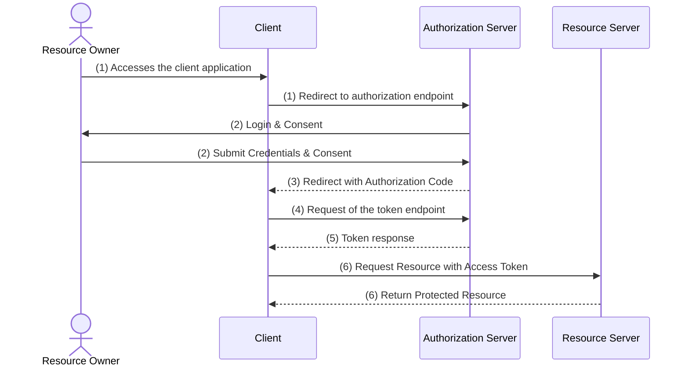

The code flow comes into place, where the client wants to retrieve a token and has the clientId, as well as the clientSecret stored. In normal client side rendered frontends it shouldn't be used, because the clientSecret shouldn't be exposed to the browser.



### 1 - Redirect to authorization endpoint
- The client application redirecting the user to an authorization endpoint of the authorization server
- It passes the clientId and the redirectUri at min (also scopes can be specified)

`https://<auth-server-host>/authorize?`  
`response_type=code`  
`&client_id=<client_id>`  
`&redirect_uri=https://<client_host>/redirect`  
`&scope=profile%20photos%3Aread`

### 2 - Login
- The authorization server waits for the user to
  - provide the credentials
  - consent for the requested scopes

### 3 - Redirect to the ClientApp
- The authorization server redirects to the client with the specified `redirect_url`
- A query parameter named `code` is added to the `redirect_url`
- `redirect_uri=https://<client_host>/redirect?code=<some_string>`

### 4 - Token endpoint
- The client application takes the code parameter and executes a silent POST request to the auth servers `/token`-endpoint

`https://<auth-server-host>/token?`  
`grant_type=authorization_code`  
`code=<some_string>`  
`&client_id=<client_id>`  
`&client_secret=<client_secret>`  
`&redirect_uri=https://<client_host>/redirect`

### 5 - Token response
- The authorization server compares the clientId, clientSecret and the code value
- If the provided parameters are valid, the authorization server responses with a token (optionally also with a refresh token)

```
{
  "access_token": "<header>.<body>.<signature>",
  "token_type": "Bearer",
  "expires_in": 3600.
  "scope": "profile photos:read"  
}
```

### 6 - Access to the resource
- At this point, the client can perform requests to the resource server on behalf of the user, scoped to its granted access